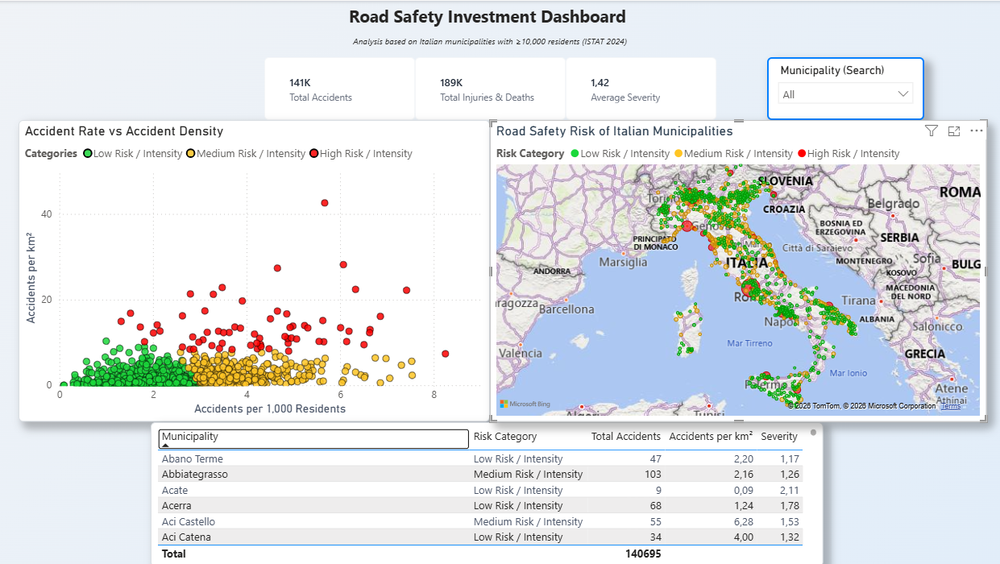

# ISTAT Traffic Analysis

## Project Overview

This project analyzes road traffic accidents in Italian municipalities using official ISTAT data merged with demographic information from SITUAS

The objective is to identify municipalities where road safety investments could have the highest impact through custom-made indicators and an interactive Power BI dashboard

## Business Objective

The analysis aims to answer the following questions:

- Which municipalities record the highest number of accidents?
- Which municipalities have the highest accident rate compared to their population?
- Which municipalities have the highest accident density per square kilometer?
- Which municipalities should be prioritized for future road safety investments?

## Data Sources

### ISTAT
- Official ISTAT Road accident statistics downloaded through Python

### SITUAS
- Resident population
- Municipality surface area

## Repository Structure

boolean-istat-traffic-analysis/
│
├── data/
│   ├── raw/
│   │   ├── raw_data.csv
│   │   └── SITUAS_2024.csv
│   └── processed/
│       └── Accidents_analysis_2024.csv
│
├── notebooks/
│   └── boolean_istat_traffic_analysis_notebook.ipynb
│
├── powerbi/
│   └── boolean_istat_traffic_analysis_power_bi.pbix
│
├── images/
│   └── power_BI_screenshot.png
│
├── slides/
├── README.md
└── .gitignore

## Methodology

1. Download of ISTAT data
2. Import of SITUAS data
3. Data cleaning
4. Data type conversion
5. Null and duplicate checks
6. Merge between datasets
7. Feature engineering
8. Exploratory Data Analysis
9. Linear Regression
10. KMeans Clustering using the Elbow Method
11. Export of the final dataset
12. Power BI dashboard development

## Feature Engineering

The following indicators were created:

- Total accidents
- Total injuries and deaths
- Accidents per 1,000 residents
- Accidents per km²
- Severity index
- Risk category derived from clustering

Municipalities with fewer than 10,000 residents were excluded from the final dashboard in order to fit the business investment logic

## Exploratory Data Analysis

The notebook includes:

- Descriptive statistics
- Variable distributions
- Correlation analysis
- Historical accident trends
- Population vs accidents analysis
- Municipality ranking
- Business interpretation of the results

## Regression Analysis

A linear regression model checks and evaluates the relationship between resident population and total accidents in order to understand how population size influences accident volume

## Clustering Analysis

Municipalities are grouped using KMeans clustering based on the KPIs (Accidents per sqkm & Accidents Every 1k residents)

The Elbow Method was used to determine the optimal number of clusters

The resulting clusters are interpreted as different road safety risk categories.

## Power BI Dashboard

The dashboard contains:

- KPI cards
- Scatter plot
- Municipality map
- Municipality table
- Interactive filters

It is designed to support business decisions by highlighting municipalities with higher road safety risk.

## Instruments Used

- Python
- Pandas
- NumPy
- Matplotlib
- Seaborn
- Scikit-learn
- Power BI
- Git
- GitHub

## How to Run

1. Clone the repository.
2. Open the notebook inside `notebooks/`.
3. Run all notebook cells.
4. The processed dataset will be exported into `data/processed/`.
5. Open the Power BI dashboard inside the `powerbi/` folder.

## Author

**Luca Chiulli**

Final Data Analytics Project  
Boolean Data Analytics Master
